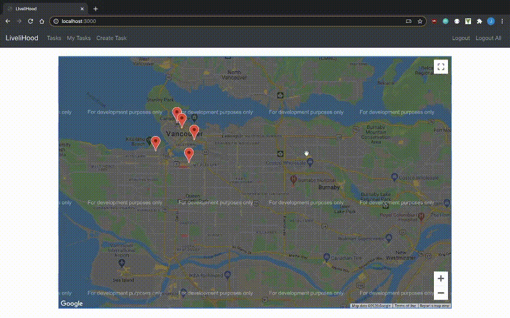

# LiveliHood

LiveliHood is a web app designed to help those who are more vulnerable to COVID-19 complete daily tasks, such as shopping at a populated grocery store. This web app allows kind-hearted users to visualize tasks in their neighbourhood on a map and volunteer to help complete them.

Deployed at https://livelihood-app.herokuapp.com/. \
**note:** if using Chrome, likely you will have to disable caching or the map won't always update. \
Right click -> Inspect -> Network -> Disable cache. Dev tools will need to be on the entire duration to keep caching disabled.

### Stack

MERN - MongoDB, Express, React, Nodejs

Other Tools:

- Google Maps API for visualization of tasks
- Axios and cors library for connecting to the backend
- Bootstrap, HTML, CSS for styling
- Jest and Supertest to automate testing in the backend
- Mongoose to manage the MongoDB database
- JWT to manage authentication middleware
- Bcrypt and Validator to hash passwords

Routes for the backend can be found in the backend folder's README

### Examples

#### Not signed in:

 \
note: The popup on each map is due to the map being in development mode, as the Google Maps API is a paid API.

#### Signed in:

#### Assigning yourself to a task and unassigning

 \
note: In this example, the user assigns himself to his own task. This is for example purposes. In a real scenario, it would be a different user who assigns themselves to this user's task.

#### Marking a task as done

 \
note: The task-poster can mark a task as done once it is in progress.\
'Logout All' at the end means removing all login tokens as opposed to just the current login token.

### TODO

- Sort tasks by status frontend
- More ways to sort tasks on the frontend
- Change logout/logoutall to a dropdown
